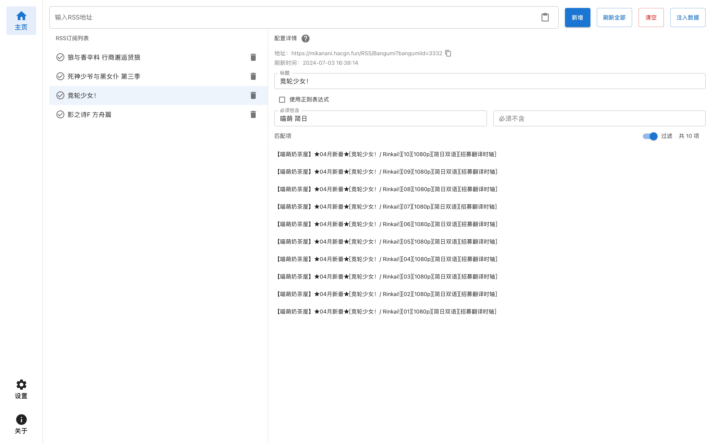
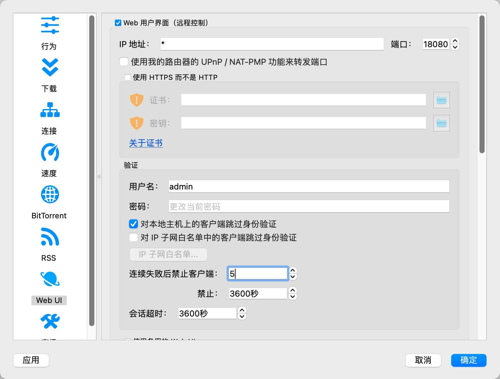

# qb-rss-tool

 

## 简介

qb-rss-tool 是用于辅助`qbittorrent`的`RSS`自动下载功能的轻量级工具，帮助你免去手动新建文件夹、添加`RSS`订阅列表和填写下载规则的重复性操作，方便新番订阅。

用户可以在添加`RSS`订阅列表后使用【注入数据】功能，指定一个文件目录，工具会在该目录下新建各个订阅的文件夹，并向`qbittorrent`注入`RSS`订阅列表和下载规则，下载规则的存储位置为之前创建的各个文件夹。

## 截图

- 主页

## 如何使用

0. （准备工作）配置`qbittorrent`，开启`RSS`自动下载相关配置，并启用`Web UI`

- `RSS`相关配置可参考该视频，[qBittorrent 如何自动追番](https://www.bilibili.com/video/BV1Bx4y1V7M4)
- `Web UI`相关配置可以参考该图，打开`设置`-`Web UI`，勾选 Web 用户界面，填写用户名和密码，勾选对本地主机上的客户端跳过身份验证
  

1. 在设置页配置`qbittorrent web ui`的`IP`地址（如果是本机则为`localhost`）、端口、用户名、密码
2. 在主页输入并新增你希望订阅的`RSS`地址，在配置详情编辑标题和过滤配置（必须包含、必须不含等）,检查匹配项
3. 配置完毕`RSS`订阅列表后，点击【注入数据】按钮，选择想存储的文件夹
4. 前往`qbittorrent`检查`RSS`订阅列表和自动下载规则的配置是否正确

## 鸣谢

- [HoYo.Gacha](https://github.com/lgou2w/HoYo.Gacha) 界面设计参考了该项目

## 相关链接

- [WebUI API (qBittorrent 4.1)](<https://github.com/qbittorrent/qBittorrent/wiki/WebUI-API-(qBittorrent-4.1)>)
- [qb-rss-manager](https://github.com/Nriver/qb-rss-manager)
- [AutoBangumi](https://github.com/EstrellaXD/Auto_Bangumi)

## 协议

[MIT License](./LICENSE)
